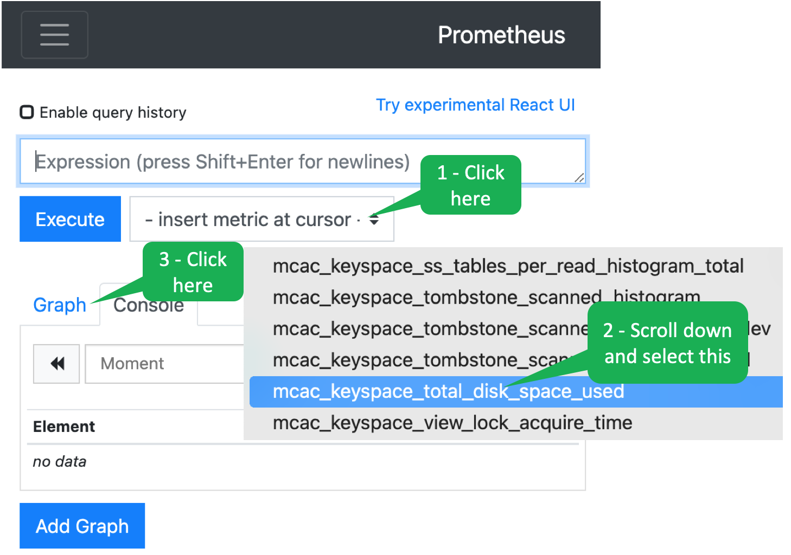
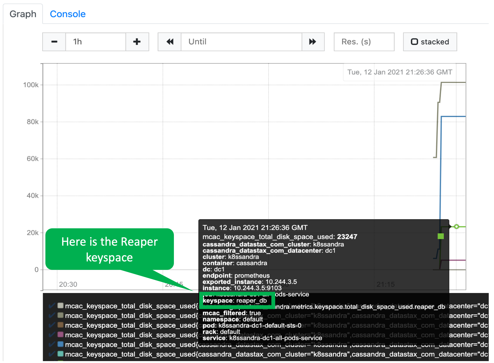

The great thing about K8ssandra is that it sets up an entire ecosystem for your Cassandra database.
This ecosystem monitors your Cassandra database and collects useful metrics using Prometheus.

  
What is Prometheus?

Prometheus is software that collects metrics, monitors events and issues alerts.
You can read more [here](https://prometheus.io/docs/introduction/overview/).

You can access Prometheus in a separate browser tab by clicking the following.

[prometheus](https://[[HOST_SUBDOMAIN]]-80-[[KATACODA_HOST]].environments.katacoda.com/prometheus)

Generally, we will use Grafana to look at the metrics that Prometheus gathers.
But, let's explore Prometheus just for fun.
Select the metric `mcac_keyspace_total_disk_space_used` by clicking as shown.

---

***NOTE:*** *You can click images in these scenarios to enlarge them.*

---

You will see a graph where each line represents the space used by each keyspace.
Hover over the lines to see the details.

  
What is a keyspace?

In Cassandra, a _keyspace_ is a collection of tables where the tables share some common characteristics.
You can think of a Cassandra keyspace as similar to what the relational world calls a _database_.
You can read more about it [here](https://docs.datastax.com/en/dse/6.0/cql/cql/cql_using/cqlKeyspacesAbout.html).

There are several system keyspaces that have already been created by K8ssandra.
For example, Reaper (which you will learn about in the next step) creates a <i>reaper_db</i> keyspace, which Reaper uses for storing its information.
See if you can determine which line represents <i>reaper_db</i>.
Then, use the graph to determine how much space that keyspace is currently using.

K8ssandra configured Prometheus to monitor many Cassandra metrics for us.
You can also configure Prometheus to monitor other metrics of interest to you so you can consolidate all your metrics into one place - more on this later.

## Superb! K8ssandra uses prometheus to collect monitoring data.
