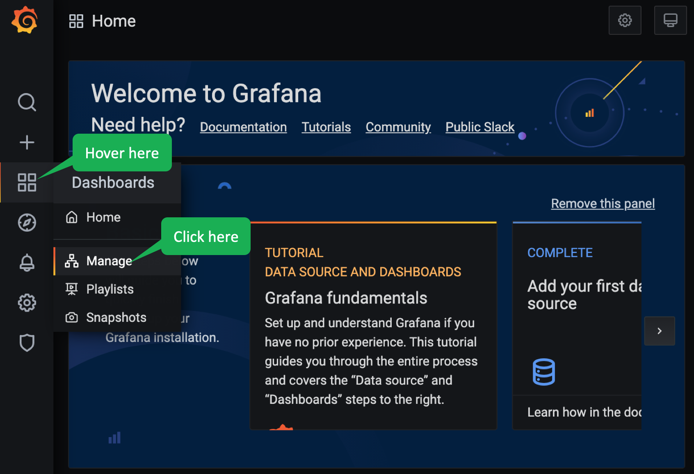
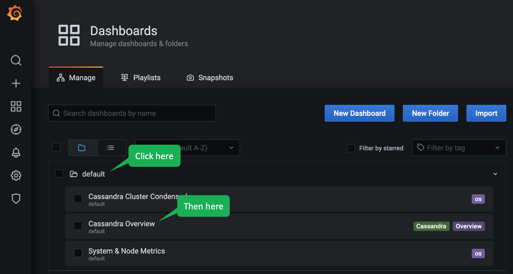

Grafana provides a useful UI frontend for the metrics that Prometheus gathers.
Click the following to view the Grafana UI.

  
What is Grafana?

Grafana is a visualization web application which provides charts, graphs, and alerts.
It is common to couple Grafana with Prometheus, but you can also use it to visualize metrics from other sources using a plug-in system.
Grafana allows you to create dashboards to visualize the metrics.
K8ssandra has configured some Grafana dashboards for visualizing Cassandra metrics.
You can read more [here](https://grafana.com/).

 

[Grafana](https://[[HOST_SUBDOMAIN]]-80-[[KATACODA_HOST]].environments.katacoda.com/grafana)

Go ahead and login.
The credentials are:
- username: admin
- password: secret

Once you are logged-in, hover over the _Dashboards_ icon on the left and click _Manage_ from the pop-up menu.

Then, click _default_ and select _Cassandra Overview_.

This dashboard shows you useful metrics about your Cassandra database.
You may notice that K8ssandra divided the dashboard into the following sections:
- Request Throughputs
- Nodes Status
- Data Status
- Cassandra Internals
- Hardware/Operating System
- JVM/Garbage Collection

Each of these sections represents important things you want to consider when managing a Cassandra database.
You are probably familiar with Hardware and Operating System metrics, so scroll down to that section and see if you can determine what the CPU utilization is and how much memory is currently being used.

Feel free to look at the other dashboards which K8ssandra has configured for you such as the _Cassandra Cluster Condensed_ or _System & Node Metrics_ to familiarize yourself with the dashboards' contents.

## Outstanding! We can monitor our Cassandra cluster with Grafana!
