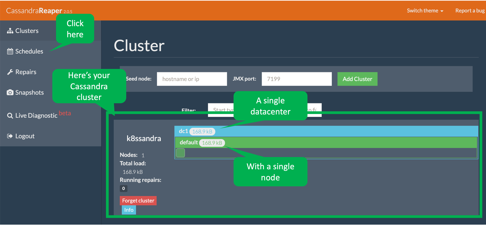
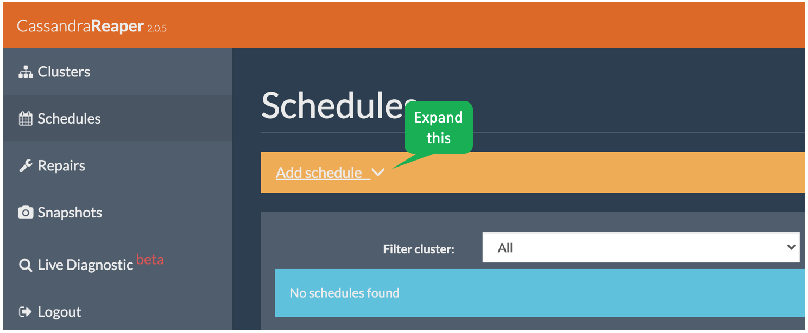
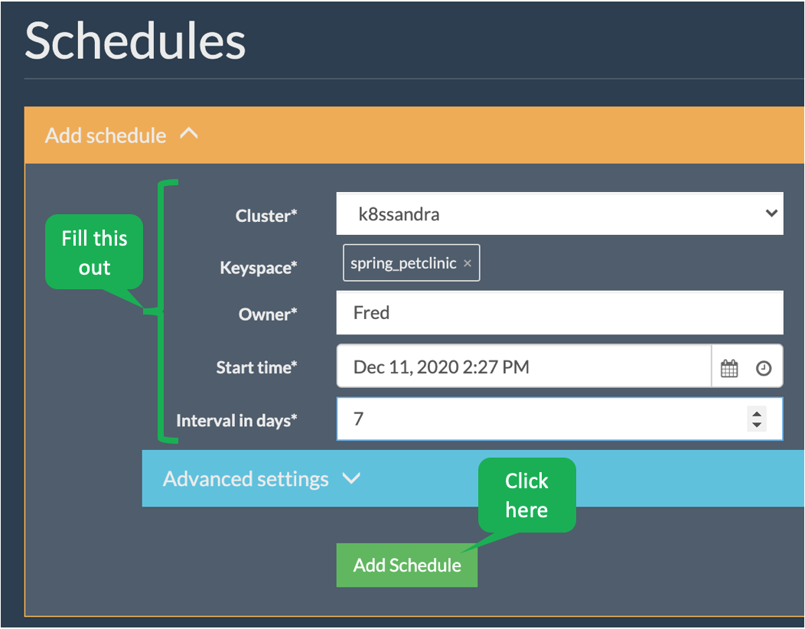
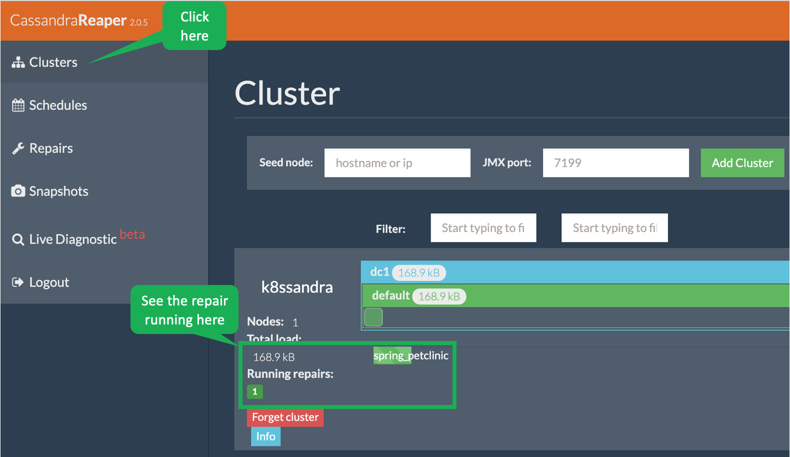

Cassandra operations management used to be a bit daunting.
One aspect of Cassandra management that used to be especially difficult to manage was _repair_.
But, thanks to _Reaper_, we can automate this task.

  
What is repair?

Cassandra's architecture is highly distributed and scalable due to data replication.
Whenever you replicate data, it is possible for the replicas to be out of sync.
Repair (an unfortunate name since nothing is really broken) is the process of making sure all data replicas are consistent.
You can read more [here](https://cassandra.apache.org/doc/latest/operating/repair.html).

Let's look at the Reaper UI by clicking the following.

[Reaper](https://[[HOST_SUBDOMAIN]]-80-[[KATACODA_HOST]].environments.katacoda.com/reaper/webui)

Let's take a quick tour of Reaper by scheduling a repair task.
Click _Schedules_.

Click _Add schedule_ to expand the form.

Fill out the form and click _Add schedule_.

In a minute or so, you can see that the repair task has started by clicking _Clusters_.

## I get it! Reaper makes Cassandra repair easy!
