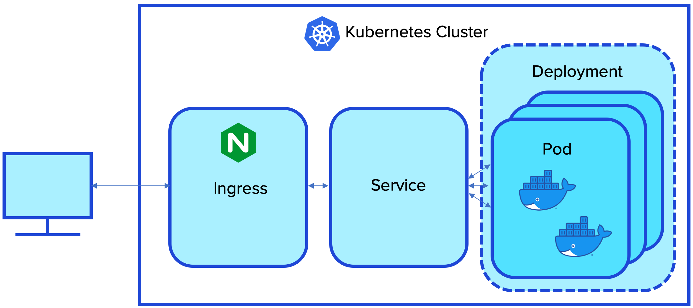

In this step we'll get set up by creating a Kubernetes cluster, and installing a Cassandra cluster (using Cassandra Operator), and the example Pet Clinic app.

Here are the specific pieces we will set up:

<ol>
  <li><b>KinD</b>
    <details>
      <summary style="color:teal">What is _KinD_?</summary>
      <hr>
      _KinD_ is development tool we are using to create a Kubernetes cluster running _inside_ a Docker container.
      As you know, most people use Kubernetes to manage systems of Docker containers.
      So, KinD is a Docker container that runs Kubernetes to manage other Docker containers - it's a bit recursive.
      <br><br>
      We use KinD so we can create a many-node Kubernetes cluster on a single machine.
      KinD is great because it's relatively light-weight, easy to install and easy to use.
      <br><br>
      For your reference, here are the commands we used to install KinD.

      <br>
      <br>
      ```
      curl -Lo ./kind https://github.com/kubernetes-sigs/kind/releases/download/v0.7.0/kind-$(uname)-amd64
      chmod +x ./kind
      mv ./kind /usr/local/bin/kind
      ```
      <br>
      <br>
      Read more [here](https://kind.sigs.k8s.io/).

      <hr>
    </details>
  </li>


  <li><b>Helm</b>
    <details>
      <summary style="color:teal">What is _Helm_?</summary>
      <hr>
      Helm is a package manager (like _apt_ or _yum_) for Kubernetes.
      Helm allows you to install and update Kubernetes applications.
      Helm uses _charts_.
      A chart is a specification file we use to tell Helm how to do the installation.
      Helm downloads the charts from a Helm repo.
      You can read more [here](https://helm.sh/).
      <hr>
    </details>
  </li>


  <li><b>Four-node Kubernetes cluster using KinD</b>
    <details>
      <summary style="color:teal">Why do we need a four-node Kubernetes cluster?</summary>
      <hr>

      First, it is important to understand we are working with two types of clusters: a Kubernetes cluster and a Cassandra cluster.
      The Kubernetes cluster is a set of machines called Kubernetes nodes.
      The Cassandra cluster is a set of those Kubernetes nodes that host and run the Cassandra software.
      <br>
      <br>
      From the Kubernetes website: A Kubernetes cluster consists of a set of worker machines, called nodes, that run containerized applications. Every cluster has at least one worker node.
      <br>
      <br>
      We are setting up a four-node Kubernetes cluster so that we have one admin node and three worker nodes.
      We'll use one worker node for the single-node Cassandra cluster, another worker node for the Pet Clinic frontend software and the third node for the Pet Clinic backend software.
      We are using KinD to create the Kubernetes cluster.
      You can review the KinD cluster configuration in this file.
      <div style="background-color:#cccccc"> **Open** `kind-config.yaml`{{open}}</div>
      <br>
      In this file you see that we are creating four nodes: a single control-plane node and three worker nodes.
      Every Kubernetes cluster needs at least one control-plane node to manage the cluster.
      The worker nodes are where we deploy our Kubernetes resources.
      The other details in the file are specific to KinD.
      <hr>
    </details>
  </li>


  <li><b>Nginx ingress controller</b>
    <details>
      <summary style="color:teal">What is an ingress and how does it fit into the Kubernetes architecture?</summary>
      <hr>
      An ingress provides access from outside a Kubernetes cluster to the components inside the cluster.
      The controller we are deploying manages instances of ingresses.
      We'll deploy an instance of an ingress when we install the app.
      <br>
      <br>
      An ingress usually sits in front of a Kubernetes service.
      <br>
      As a brief refresher, the Kubernetes architecture consists of:
      <ul>
        <li><b>Containers</b> - usually Docker containers that provide an isolated environment for a program</li>
        <li><b>Pods</b> - encapsulate one or more containers</li>
        <li><b>Deployments</b> - encapsulate the replication of pods</li>
        <li><b>Services</b> - often work as load balancers for a deployment of pods</li>
        <li><b>Nodes</b> - machines for hosting Pods</li>
      </ul>
      <br>

      Here's a diagram of these components that shows the position of the ingress.
      Note that we left out the nodes because the diagram gets too cluttered, but you can imagine that Kubernetes maps the various components to nodes/machines within the cluster (you can click on the image to enlarge it).
      <br>
      <br>
      
      <hr>
    </details>
  </li>

  <li><b>Cassandra Operator (and associated StorageClass)</b>
    <details>
      <summary style="color:teal">What is the Cassandra Operator and the StorageClass?</summary>
      <hr>
      The Cassandra Operator is a Kubnernetes package that simplifies managing your Kubernetes Cassandra cluster in a couple of ways.
      <ol>
        <li>The operator introduces higher level constructs such as datacenters that don't occur in native Kubernetes</li>
        <li>The operator monitors your Cassandra cluster to keep it running in a state you specify</li>
      </ol>
      If a Cassandra node were to fail, the Cassandra Operator would create a replacement node.
      Also, if you decide to change the number of nodes in your Cassandra cluster (either increasing or decreasing), the operator manages the change for you.
      <br>
      Read more about the Cassandra Operator [here](https://github.com/datastax/cass-operator/tree/master/docs/user).
      <br>
      Kubernetes operators use two Kubernetes constructs:
      <ul>
        <li><b>Custom Resource Definitions (CRD)</b> - these introduce higher level abstractions (e.g., datacenters)</li>
        <li><b>Custom control-loop logic</b> - introduces domain-specific logic for managing domain specific resources (e.g., Cassandra rolling restarts)</li>
      </ul>
      <br>
      Many Kubernetes resources are stateless and ephemeral, which allows Kubernetes to replace instances of these resources at will.
      However, this approach cannot support a database.
      Databases require statefulness/persistence, which is what a StorageClass provides.
      StorageClasses allow you to specify the quality of service for your stateful storage.
      <hr>
      <br>
    </details>
  </li>


  <li><b>One-node Cassandra cluster</b>
    <details>
      <summary style="color:teal">Is the Cassandra Operator the same thing as a Cassandra cluster?</summary>
      <hr>
      The Kubernetes Cassandra Operator is *NOT* a Cassandra cluster - it's a Kubernetes construct that controls Cassandra clusters.
      The Kubernetes Cassandra Operator performs tasks like monitoring the Cassandra nodes so that if one fails, the operator can replace it.
      So, once you have Kubernetes Cassandra Operator installed, you still need to deploy a Cassandra cluster for the operator to manage.
      <br>
      <br>
      In this example we are deploying a one-node Cassandra cluster.
      Normally, you would have at least three-nodes in your Cassandra cluster, but for educational purposes (and because of the limited resources within the Katacoda environment) we will only provision a single node.
      <hr>
    </details>
  </li>


  <li><b>Java Spring Pet Clinic example app</b>
    <details>
      <summary style="color:teal">What is the Pet Clinic app?</summary>
      <hr>
      The Pet Clinic app is the reference app for the Java Spring frame work.
      This app manages data for a simple pet clinic business.
      You can read more [here](https://projects.spring.io/spring-petclinic/).
      <br>

      The Kubernetes Pet Clinic app consists of five components:
      <ul>
        <li>Frontend deployment - provides a UI for the app</li>
        <li>Frontend service - directs traffic to the frontend pods and works as a load balancer</li>
        <li>Backend deployment - provides a data microservice for the frontend</li>
        <li>Backend service - directs traffic to the backend pods and can work as a load balancer</li>
        <li>Ingress instance - Directs traffic from outside the Kubernetes cluster to the services</li>
      </ul>
      You can check out the manifest for deploying these components.
      <div style="background-color:#cccccc"> **Open** `petclinic.yaml`{{open}}</div>
      <hr>
    </details>
  </li>


  <li><b>Connect the Pet Clinic app to the Cassandra cluster</b>
    <details>
      <summary style="color:teal">How does the Pet Clinic app connect to Cassandra?</summary>
      <hr>
      Within the Kubernetes environment, the Cassandra nodes run in their own pods, which are separate from the app pods.
      So, as the Pet Clinic app initializes, it must establish a connection between its pods and the Cassandra pod.
      This can take a little bit of time when the Pet Clinic app first starts talking to Cassandra, but after that, the connection is fast.
      <hr>
    </details>
  </li>
</ol>


It's a fair amount of work to configure and deploy all the resources necessary for this scenario, so please be patient as it completes.


When all eight installation steps are complete, you can launch the Pet Clinic app to see that it works.

<div style="background-color:#cccccc">[Pet Clinic](https://[[HOST_SUBDOMAIN]]-80-[[KATACODA_HOST]].environments.katacoda.com/)</div>
<br>
You've seen the Pet Clinic app in previous scenarios, so just click on the _Pet Types_ tab to show that the frontend UI is talking to the backend microservice, and that the backend is connected to the Cassandra database.
When you see the list of Pet Types, you know everything is working correctly!

## Woot! We have the complete Pet Clinic app running.
