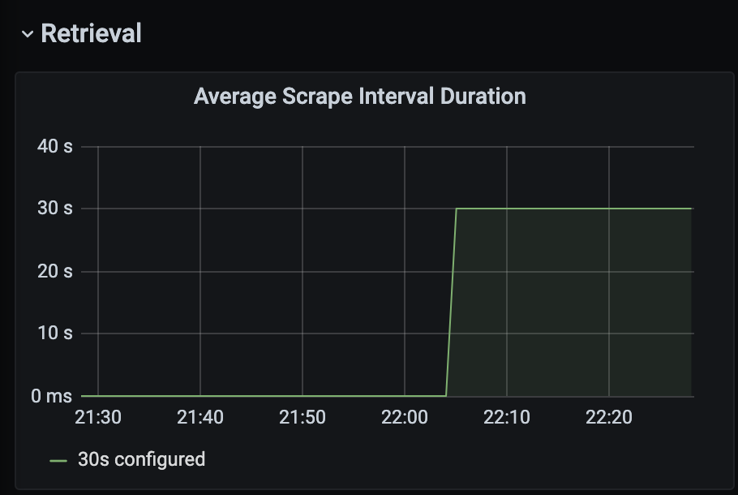

Let's install Prometheus and Grafana.

Here's how the pieces fit together.


In this diagram, we see the following components:
- Grafana - provides dashboards for viewing metrics
- Prometheus - retrieves and stores metrics
- ServiceMonitor - Prometheus Operator CRD that interfaces with Kubernetes services
- Services - access points for Kubernetes deployments
- Operator - Kubernetes controller that monitors Prometheus
- Prometheus Server - provides HTTP service for querying Prometheus

Prometheus provides an operator, which we install using Helm.
We need to add the necessary Helm repo prior to performing the install so Helm knows where to find the chart.

```
helm repo add prometheus-community https://prometheus-community.github.io/helm-charts
helm repo update
```{{execute T1}}

Below is the command to install the Prometheus Operator.
The `-f config-values.yaml` is a way to override some default values for the operator (we have changed some defaults mainly for operation in our learning environment).

```
helm install monitoring prometheus-community/kube-prometheus-stack -f config-values.yaml
```{{execute T1}}

If you are interested, you can check out the configuration file.
As we said, most of this file is configuration specifically for our learning environment.
But, for example, you may be able to find where we set the default admin password.

<div style="background-color:#cccccc"> **Open** `config-values.yaml`{{open}}</div>


Although we installed the Prometheus Operator, it may still need to initialize.
This command will wait until the operator is ready.

```
kubectl wait \
  --for=condition=ready pod \
  --selector=app=prometheus \
  --timeout=60s
```{{execute T1}}

With the operator installed, we can access the Prometheus Server from a new browser tab.

<div style="background-color:#cccccc">[Prometheus](https://[[HOST_SUBDOMAIN]]-80-[[KATACODA_HOST]].environments.katacoda.com/prometheus)</div>

Within the Prometheus Server bowser tab, click on _Status_, then click on _Targets_ as shown.


This shows you a list of all the default Prometheus targets which include Kubernetes, operating system and machine metrics.

<details>
  <summary style="color:teal">What is a Prometheus target?</summary>
  <hr>
  Prometheus can collect metrics from many sources.
  Prometheus does this by _pulling_ data from these sources and, therefore, refers to the sources as _targets_.
  What you are seeing in the list of targets are the default sources that Prometheus is using to gather metrics.
  <hr>
</details>

In the next few steps, we'll add our own targets.

We can get a better view of the metrics using Grafana.
Click the following to open Grafana in a new tab.
<div style="background-color:#cccccc">[Grafana](https://[[HOST_SUBDOMAIN]]-80-[[KATACODA_HOST]].environments.katacoda.com/grafana)</div>

Go ahead and login.
The credentials are:
- username: admin
- password: secret

Once you are logged-in, hover over the _Dashboards_ icon on the left and click _Manage_ from the pop-up menu.


You should now be seeing a list of Grafana Dashboards.
Scroll down the list and select _Prometheus Overview_ (near the bottom of the list).

An interesting side note about Prometheus is it can monitor many different sources including itself.
The _Prometheus Dashboard_ shows various Prometheus metrics.
Scroll down to the _Retrieval_ section and look at the graph entitled _Average Scrape Interval Duration_.



Prometheus obtains metrics by _scraping_ its sources.
Can you figure out what this graph represents?
<br>
In the next step, we'll look at monitoring some of our own metrics.
<br>
## Outstanding! You have Prometheus and Grafana running on your Kubernetes cluster!
