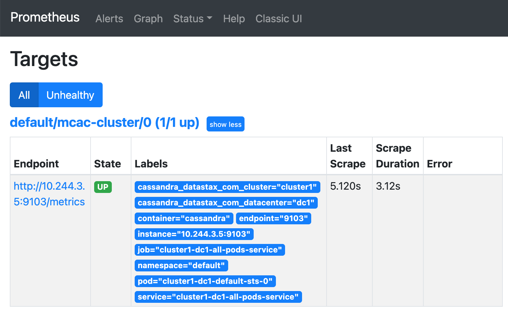

Let's set up Prometheus to monitor some Cassandra metrics.
<br>

Configuring Prometheus and Grafana can be a bit overwhelming, but we have you covered!

We will set up the a ServiceMonitor to monitor our Cassandra endpoints.
We do this by applying a Kubernetes manifest.
You can check out the manifest.
<div style="background-color:#cccccc"> **Open** `prom_service_monitor.yaml`{{open}}</div>

As you can see, it's a scary file with all kinds of regex for identifying Cassandra endpoints.
The explanation of this file is well beyond anything we want to discuss here, so let's just go ahead and apply the manifest.

```
kubectl apply -f prom_service_monitor.yaml
```{{execute T1}}

Return to the Prometheus tab in the browser and refresh the _Targets_ page.
Or, click the following to go there directly in a new browser tab.

<div style="background-color:#cccccc">[Prometheus Targets](https://[[HOST_SUBDOMAIN]]-80-[[KATACODA_HOST]].environments.katacoda.com/prometheus/targets)</div>


You may need to refresh the page a few times, but eventually you will see the following target at the top of the list.
If the target is red, just refresh a few more times and it will turn blue.



_MCAC_ stands for _Metric Collector for Apache Cassandra_ and is the target for the Cassandra metrics.

## Great! Prometheus is ready to start collecting metrics on your Cassandra cluster!
